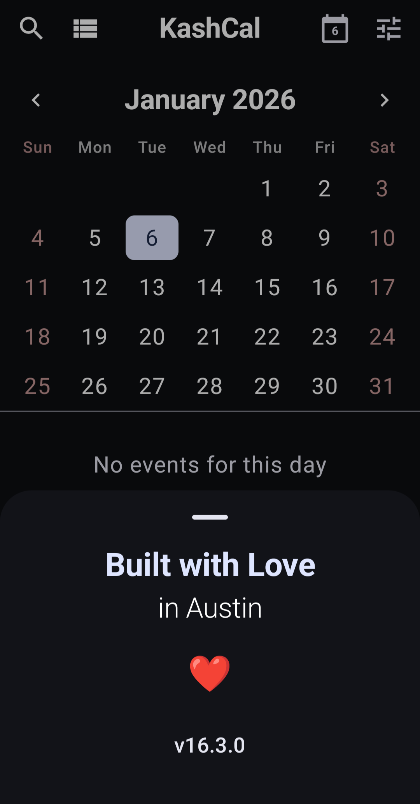
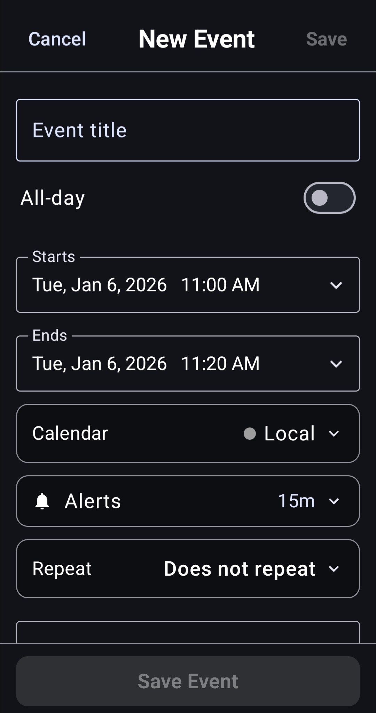
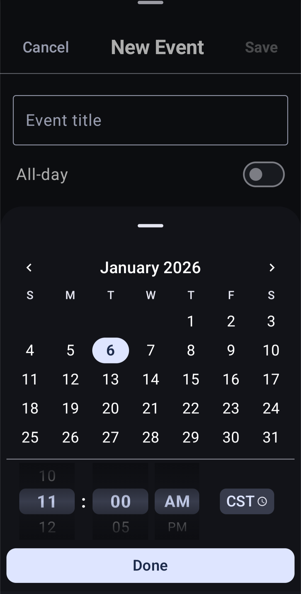
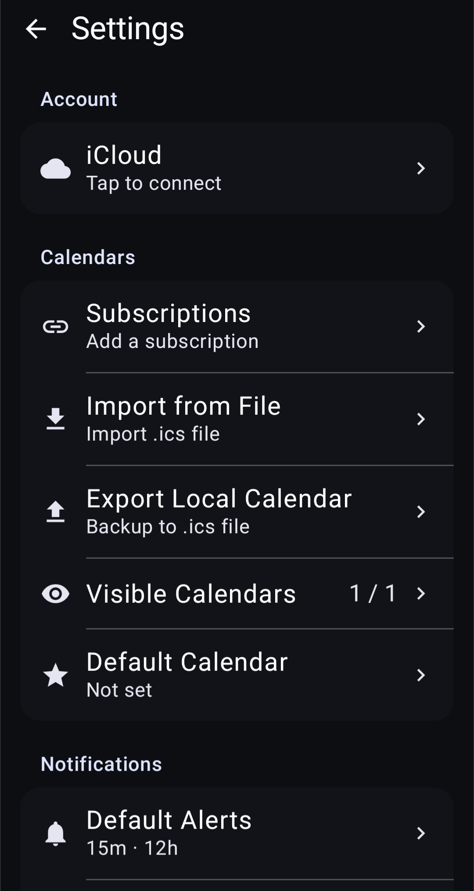
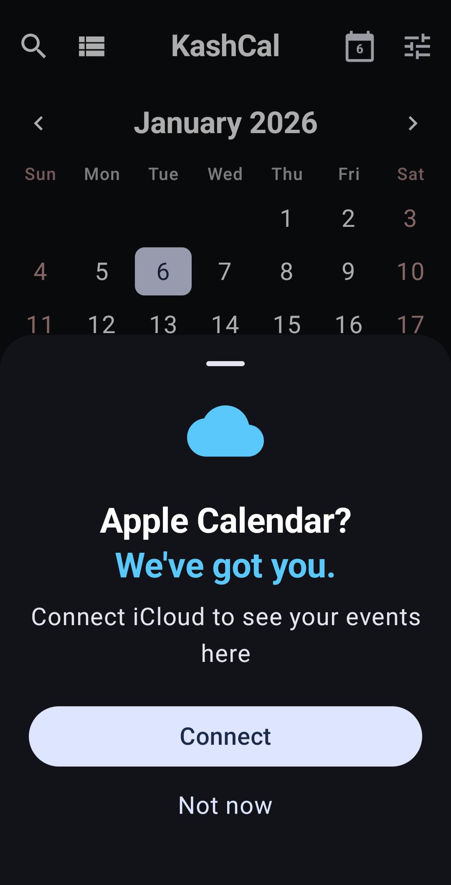
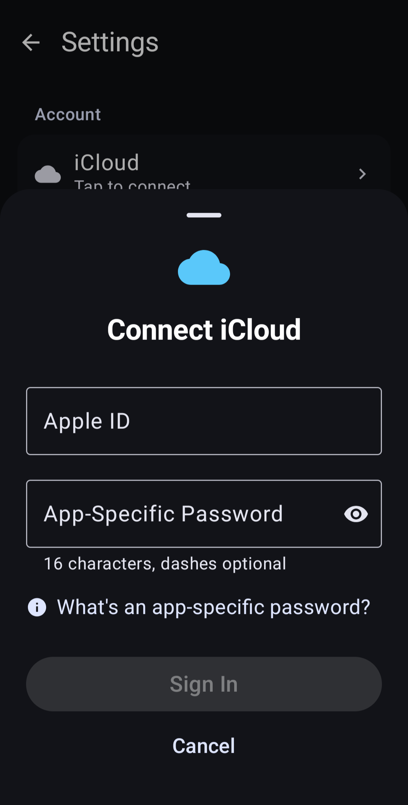
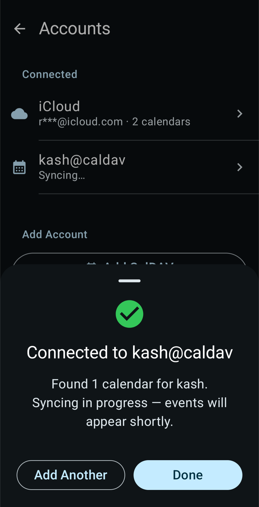
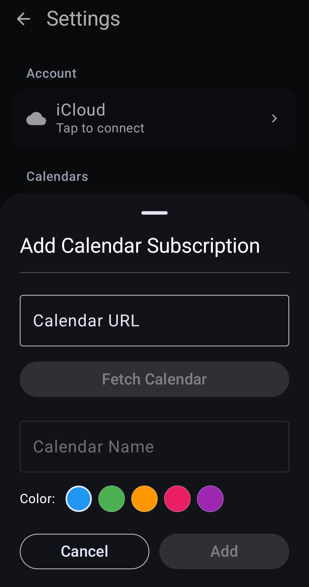

<div align="center">


# KashCal

**Your calendar. Your device. Your rules.**

A modern, privacy-first calendar with iCloud and CalDAV sync — finally done right on Android. Works offline. Looks beautiful. Doesn't track you.

[](https://f-droid.org/packages/org.onekash.kashcal)
[](https://apt.izzysoft.de/fdroid/index/apk/org.onekash.kashcal)

[](https://github.com/KashCal/KashCal/releases)
[](LICENSE)

---

<table>
<tr>
<td></td>
<td></td>
<td></td>
<td></td>
</tr>
<tr>
<td></td>
<td></td>
<td></td>
<td></td>
</tr>
</table>

---

</div>

## Why KashCal?

- **Left iPhone but not iCloud?** We sync with Apple Calendar natively
- **Don't trust Big Tech with your schedule?** We don't collect anything
- **Self-host your life?** We speak CalDAV fluently
- **Privacy apps look terrible?** We disagree

## Why Calendar Privacy Matters

Your calendar reveals your life: doctor appointments, job interviews, who you meet, where you travel. When calendar apps connect to cloud AI systems, this data becomes an attack surface.

**[Recent research](https://www.miggo.io/post/weaponizing-calendar-invites-a-semantic-attack-on-google-gemini)** demonstrated how attackers can weaponize calendar invites to extract private data through AI assistants. A single malicious invite can trigger silent exfiltration of your entire schedule.

## Features

- **iCloud & CalDAV** — Sync with Apple Calendar, Nextcloud, Radicale, Baïkal, and more
- **Offline-First** — Works without internet. Sync when you want
- **Material You** — Beautiful design with dynamic theming
- **Home Widgets** — Agenda, week view, and date widgets
- **ICS Subscriptions** — Subscribe to public calendars (holidays, sports, etc.)
- **Contact Birthdays** — Auto-generate birthday calendar from contacts
- **Search** — Full-text search across all your events
- **Travel Friendly** — Set timezone per event

## Security & Privacy

**Your Data Stays Yours:**

- **No Analytics** — Zero tracking or telemetry
- **No Accounts** — No KashCal account required
- **Local-First** — Data stored on your device
- **Open Source** — Fully auditable codebase

**Secure by Design:**

- **Fort Knox Mode** — Other apps have no access to your events
- **Encrypted Credentials** — AES-256-GCM via Android Keystore
- **HTTPS Only** — Cleartext traffic blocked
- **No WebViews** — Native UI only
- **Minimal Permissions** — Only what's necessary

## Tested CalDAV Providers

| Provider | Status |
|----------|--------|
| iCloud | ✓ |
| Nextcloud | ✓ |
| Baïkal | ✓ |
| Radicale | ✓ |

Found a CalDAV server that doesn't work? [Let us know](https://github.com/KashCal/KashCal/issues)!

---

<details>
<summary><strong>For Developers</strong></summary>

### Tech Stack

| Category | Technology |
|----------|------------|
| CalDAV/ICS | [iCalDAV](https://github.com/icaldav/icaldav) |
| UI | Jetpack Compose, Material 3 |
| Widgets | Jetpack Glance |
| Database | Room + FTS4 full-text search |
| Security | Android Keystore (AES-256-GCM) |
| DI | Hilt |
| Async | Kotlin Coroutines + Flow |
| Background | WorkManager |
| Network | OkHttp |

### Building from Source

```bash
git clone https://github.com/KashCal/KashCal.git
cd KashCal
./gradlew assembleDebug
```

### Requirements
- Android Studio (latest stable)
- JDK 17
- Android SDK 35

See [CONTRIBUTING.md](CONTRIBUTING.md) for guidelines.

</details>

---

<div align="center">

**[Website](https://kashcal.github.io)** · **[Issues](https://github.com/KashCal/KashCal/issues)** · **[Releases](https://github.com/KashCal/KashCal/releases)**

Apache License 2.0 — see [LICENSE](LICENSE)

</div>
