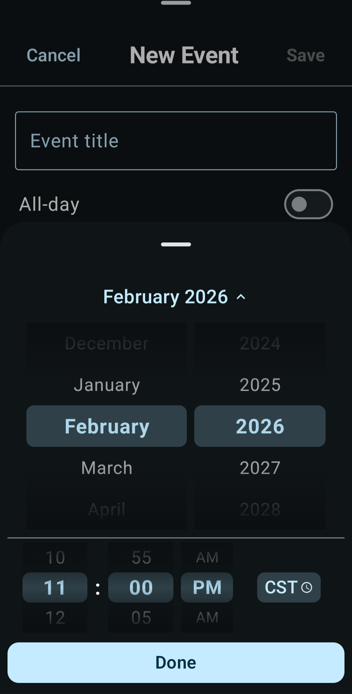
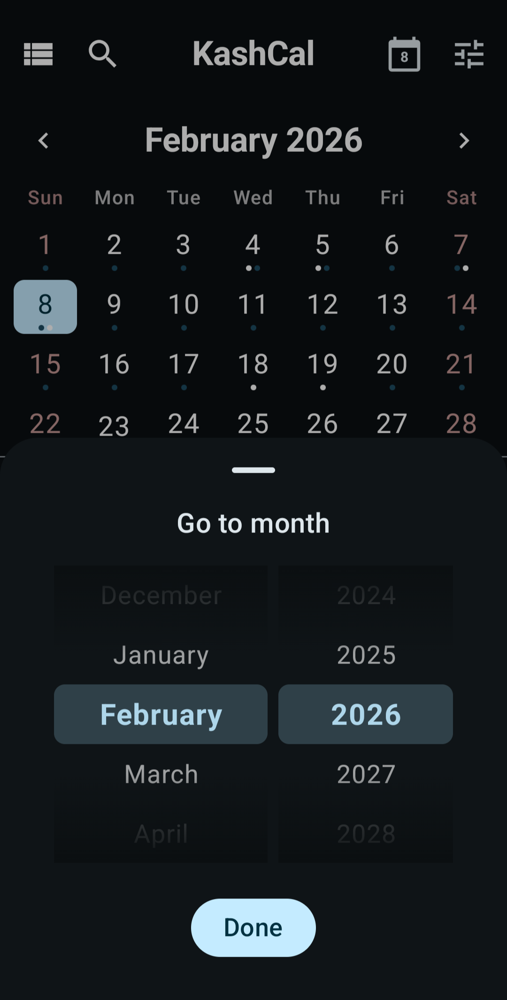
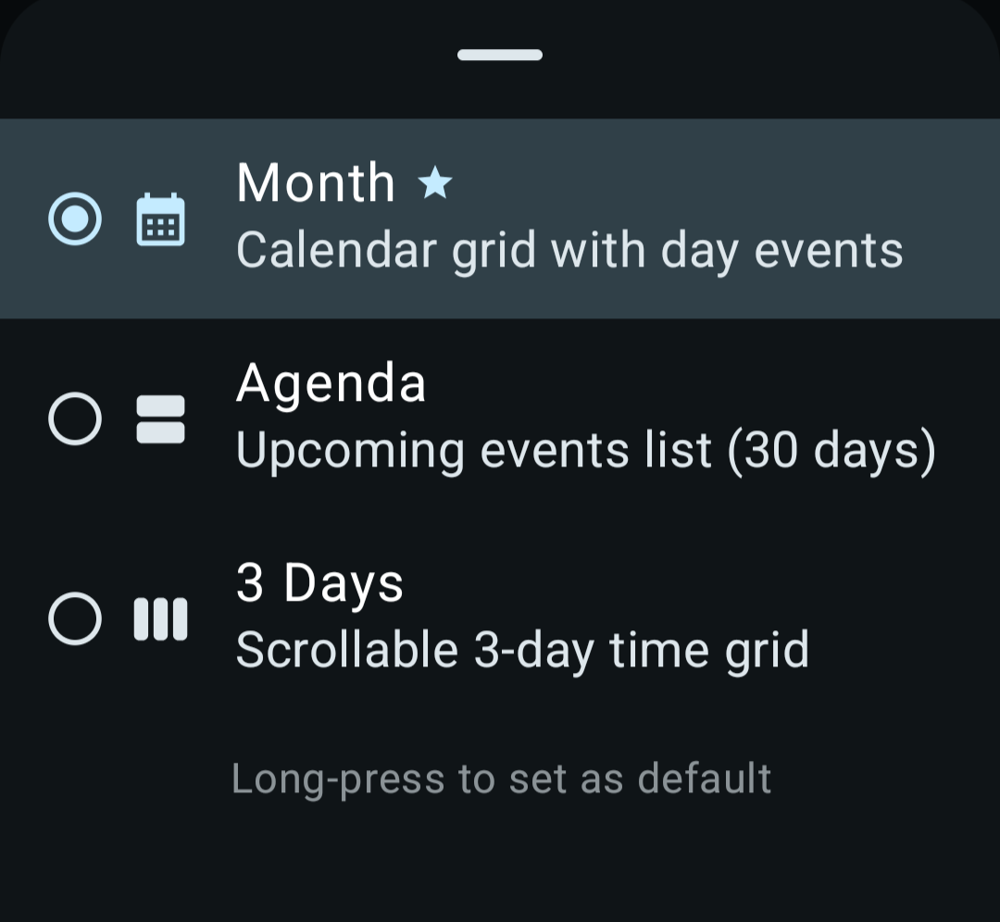
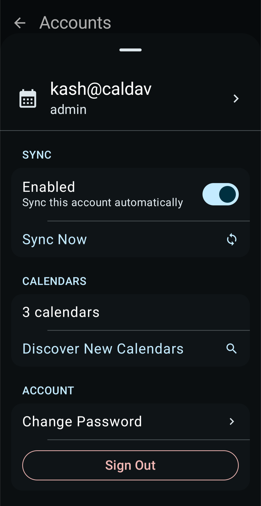
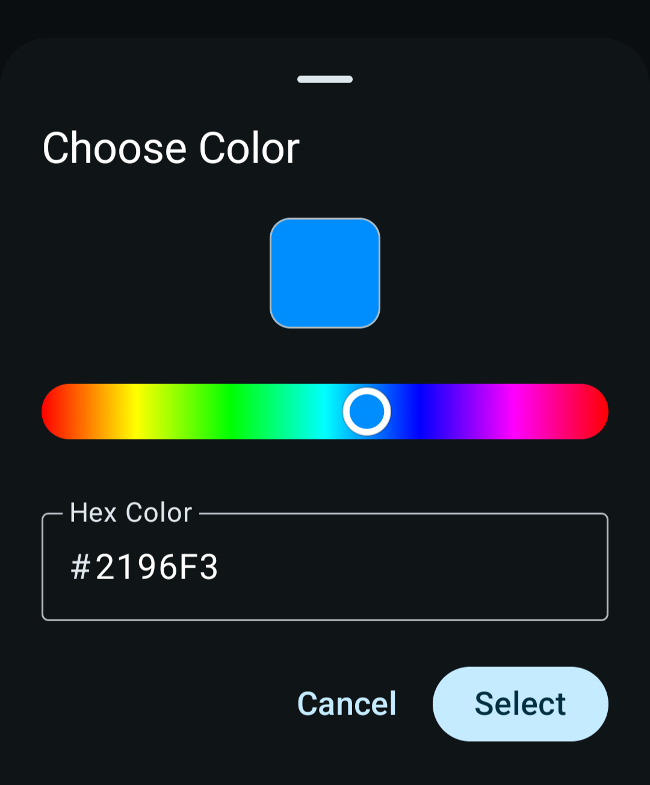

<div align="center">


# KashCal™

**A private, offline-first calendar for Android with iCloud and CalDAV sync.**

[](https://f-droid.org/packages/org.onekash.kashcal)
[](https://apt.izzysoft.de/fdroid/index/apk/org.onekash.kashcal)

[](https://github.com/KashCal/KashCal/releases)
[](LICENSE)

> **Official Repository:** This is the only official KashCal™ source. Only download from [F-Droid](https://f-droid.org/packages/org.onekash.kashcal), [IzzyOnDroid](https://apt.izzysoft.de/fdroid/index/apk/org.onekash.kashcal), or [GitHub Releases](https://github.com/KashCal/KashCal/releases). Beware of copies distributing APKs from other sources.

---

<table>
<tr>
<td></td>
<td></td>
<td></td>
<td></td>
</tr>
<tr>
<td></td>
<td></td>
<td></td>
<td></td>
</tr>
<tr>
<td></td>
<td></td>
<td></td>
<td></td>
</tr>
</table>

---

</div>

## Why KashCal?

Most calendar apps either lock you into a cloud ecosystem or look like they were built in 2012. KashCal syncs natively with iCloud and CalDAV servers (Nextcloud, Radicale, Baïkal, etc.) while keeping everything on your device by default. No account required, no analytics, no telemetry.

If you switched from iPhone to Android but still use iCloud calendars, this is probably the app you've been looking for.

## Why Calendar Privacy Matters

Your calendar reveals your life: doctor appointments, job interviews, who you meet, where you travel. When calendar apps connect to cloud AI systems, this data becomes an attack surface.

**[Recent research](https://www.miggo.io/post/weaponizing-calendar-invites-a-semantic-attack-on-google-gemini)** demonstrated how attackers can weaponize calendar invites to extract private data through AI assistants. A single malicious invite can trigger silent exfiltration of your entire schedule.

## Features

- **iCloud & CalDAV sync**: Apple Calendar, Nextcloud, Radicale, Baïkal, and more
- **Offline-first**: works without internet; sync when you want
- **Material You** with dynamic theming
- **Home widgets**: agenda, week view, and date
- **ICS subscriptions** for public calendars (holidays, sports, etc.)
- **Contact birthdays** auto-generated from your contacts
- **Full-text search** across all events
- **Per-event timezone** for travel

## Security & Privacy

No analytics, no tracking, no KashCal account required. Data is stored locally unless you explicitly set up sync.

- **Fort Knox Mode**: other apps have no access to your events
- **Encrypted credentials** via Android Keystore (AES-256-GCM)
- **HTTPS only**: cleartext traffic blocked
- **No WebViews**: native UI only
- **Minimal permissions**: only what's necessary
- **Fully auditable**: open source codebase

## Tested CalDAV Providers

| Provider | Status | Tested By |
|----------|--------|-----------|
| iCloud | ✓ | [@one-kash](https://github.com/one-kash) |
| Nextcloud | ✓ | [@one-kash](https://github.com/one-kash) [@dev-inside](https://github.com/dev-inside) |
| Baïkal | ✓ | [@one-kash](https://github.com/one-kash) |
| Baïkal (Digest Auth) | ✓ | [@englut](https://github.com/englut) |
| Radicale | ✓ | [@one-kash](https://github.com/one-kash) |
| mailbox.org | ✓ | [@h1nnak](https://github.com/h1nnak) |
| Infomaniak | ✓ | [@dirko-madrileno](https://github.com/dirko-madrileno) |
| Stalwart | ✓ | [@OneCreek](https://github.com/OneCreek) |
| FastMail | ✓ | [@mittensicle](https://github.com/mittensicle) |
| [Davis](https://github.com/tchapi/davis) | ✓ | [@Ivan-Roger](https://github.com/Ivan-Roger) |

Found a CalDAV server that doesn't work? [Let us know](https://github.com/KashCal/KashCal/issues)!

---

<details>
<summary><strong>For Developers</strong></summary>

### Tech Stack

| Category | Technology |
|----------|------------|
| CalDAV/ICS | [iCalDAV](https://github.com/icaldav/icaldav) |
| UI | Jetpack Compose, Material 3 |
| Widgets | Jetpack Glance |
| Database | Room + FTS4 full-text search |
| Security | Android Keystore (AES-256-GCM) |
| DI | Hilt |
| Async | Kotlin Coroutines + Flow |
| Background | WorkManager |
| Network | OkHttp |

### Building from Source

```bash
git clone https://github.com/KashCal/KashCal.git
cd KashCal
./gradlew assembleDebug
```

### Requirements
- Android Studio (latest stable)
- JDK 17
- Android SDK 35

See [CONTRIBUTING.md](CONTRIBUTING.md) for guidelines.

</details>

---

<div align="center">

**[Website](https://kashcal.github.io)** · **[Issues](https://github.com/KashCal/KashCal/issues)** · **[Releases](https://github.com/KashCal/KashCal/releases)**

Apache License 2.0 (see [LICENSE](LICENSE))

</div>
