<div align="center">


# KashCal™

**All your calendars in one private app on Android.**

[](https://play.google.com/store/apps/details?id=org.onekash.kashcal)
[](https://f-droid.org/packages/org.onekash.kashcal)

<sub>Also on [IzzyOnDroid](https://apt.izzysoft.de/fdroid/index/apk/org.onekash.kashcal), [Obtainium](https://apps.obtainium.imranr.dev/redirect?r=obtainium://app/%7B%22id%22:%22org.onekash.kashcal%22,%22url%22:%22https://github.com/KashCal/KashCal%22,%22author%22:%22KashCal%22,%22name%22:%22KashCal%22,%22additionalSettings%22:%22%7B%5C%22about%5C%22:%5C%22All%20your%20calendars%20in%20one%20private%20app%5C%22,%5C%22appAuthor%5C%22:%5C%22KashCal%5C%22%7D%22%7D), or [GitHub Releases](https://github.com/KashCal/KashCal/releases).</sub>

[](https://github.com/KashCal/KashCal/releases)
[](LICENSE)
[](https://github.com/sponsors/one-kash)
[](https://deepwiki.com/KashCal/KashCal)

> **Official Repository:** This is the only official KashCal™ source. Only download from [Google Play](https://play.google.com/store/apps/details?id=org.onekash.kashcal), [F-Droid](https://f-droid.org/packages/org.onekash.kashcal), [IzzyOnDroid](https://apt.izzysoft.de/fdroid/index/apk/org.onekash.kashcal), [GitHub Releases](https://github.com/KashCal/KashCal/releases), or via [Obtainium](https://obtainium.imranr.dev/). Beware of copies distributing APKs from other sources.

**APK Signing Certificate (SHA-256):**
`B0:47:6C:12:88:28:BE:04:7B:64:FE:43:F7:9B:1D:5F:2C:34:60:B0:72:6F:B3:99:33:B1:16:20:D8:95:46:22`
<br>This certificate applies to GitHub Release, IzzyOnDroid, and Obtainium APKs. Verify those with [AppVerifier](https://github.com/soupslurpr/AppVerifier) or Obtainium. F-Droid builds use F-Droid's own signing key, and Google Play builds use Google Play's app signing key, so their certificates differ.

---

<table>
<tr>
<td>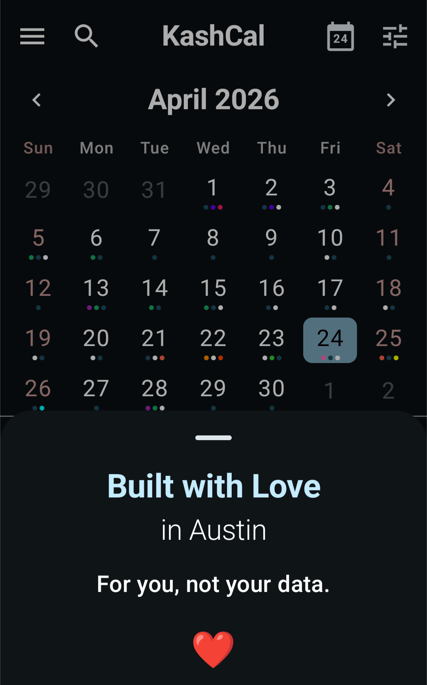</td>
<td></td>
<td>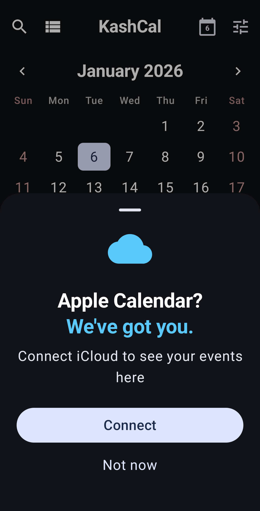</td>
<td>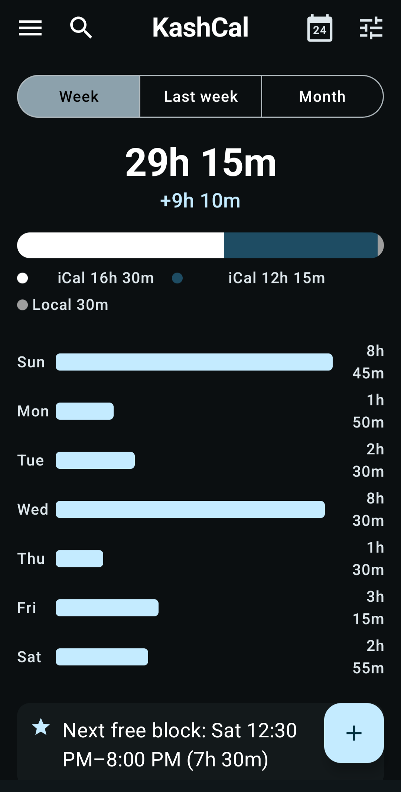</td>
</tr>
<tr>
<td>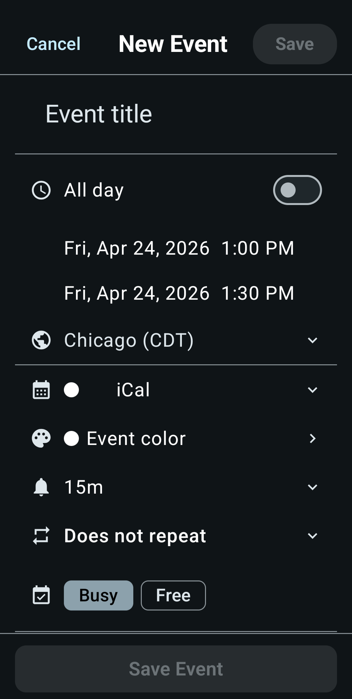</td>
<td>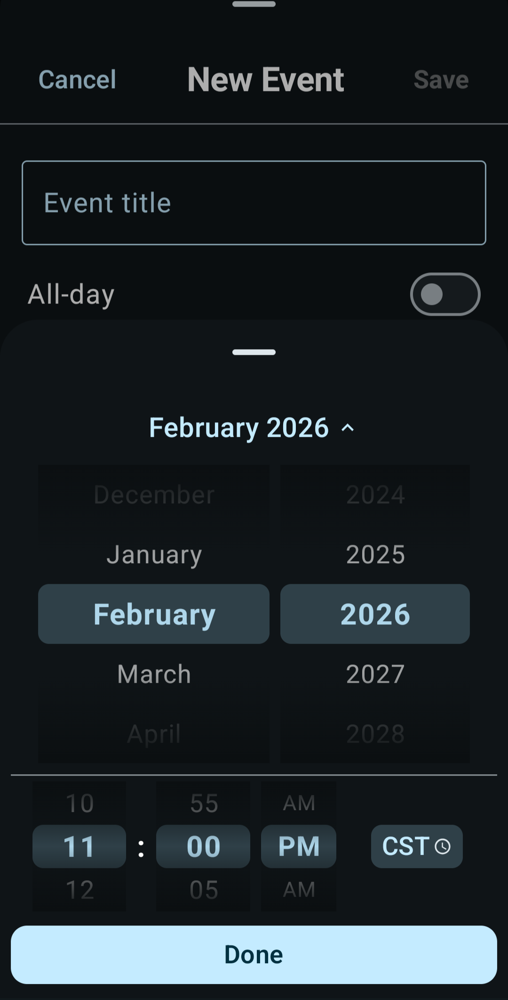</td>
<td>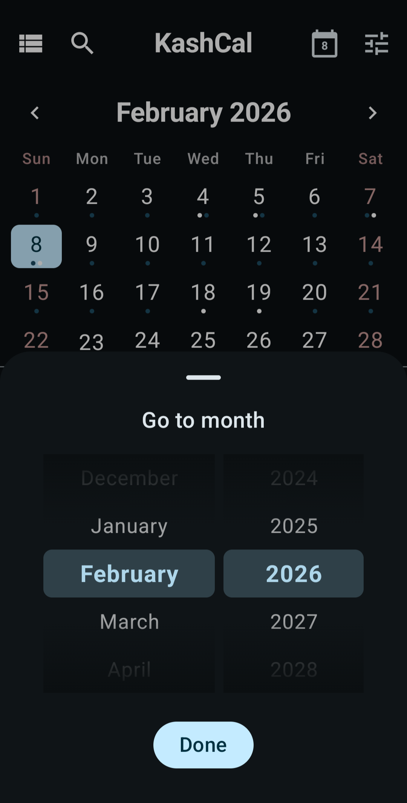</td>
<td>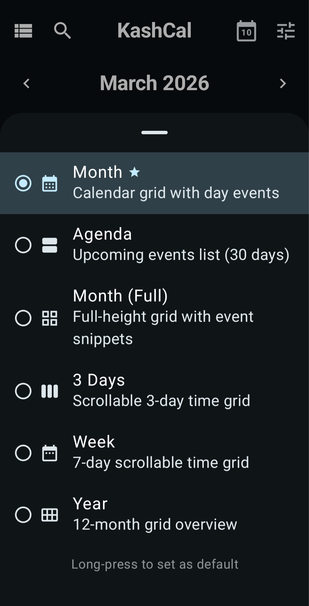</td>
</tr>
<tr>
<td>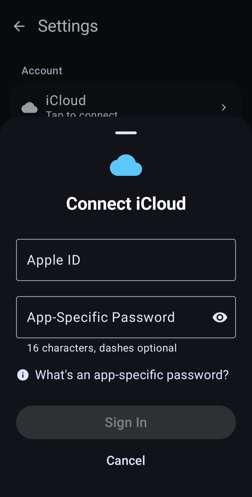</td>
<td>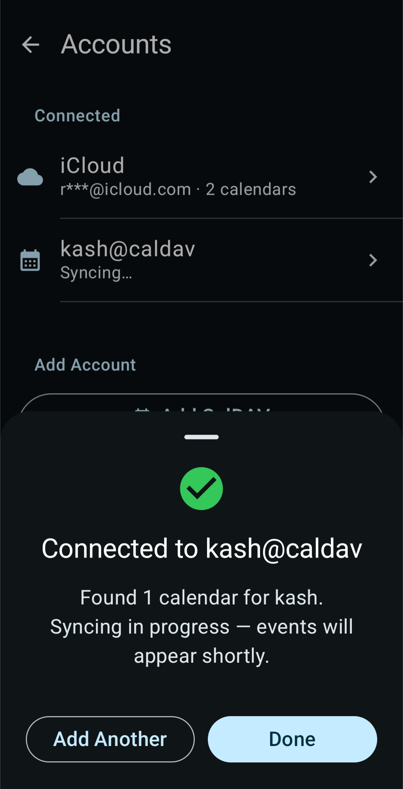</td>
<td>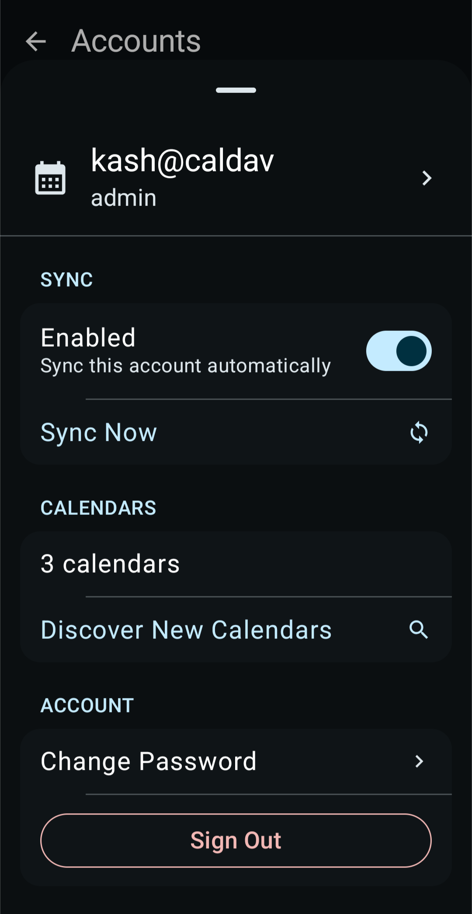</td>
<td>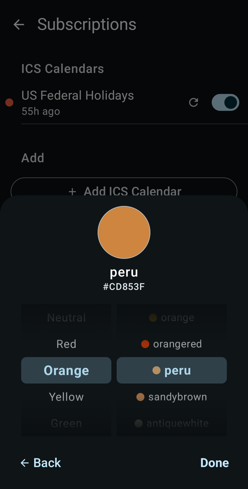</td>
</tr>
</table>

---

</div>

## Your calendars are everywhere

Family stuff on iCloud. Holidays from some website. Birthdays buried in your contacts. Work on Nextcloud. KashCal brings them together on your Android. No account required, no analytics, no telemetry.

## Your schedule, together

- **iCloud**: Switched to Android but your family is still on Apple? Sync with iCloud calendars directly. No workaround needed.
- **CalDAV**: Nextcloud, Radicale, Baïkal, Stalwart, Purelymail, FastMail, Zoho, SOGo, and more. Native sync, no middleware.
- **Device calendar**: See events from your phone's built-in calendar alongside everything else.
- **Holidays & schedules**: Subscribe to any ICS calendar. Holidays, school schedules, sports seasons.
- **Birthdays**: Pulls from your contacts automatically.
- **Local**: Don't need sync? Works fully offline out of the box.

Material You with dynamic theming. Home screen widgets. Full-text search across all events. Per-event timezone for travel.

## Private by default

No analytics, no tracking, no KashCal account required. Data is stored locally unless you explicitly set up sync.

- **Fort Knox Mode**: other apps have no access to your events
- **Encrypted credentials** via Android Keystore (AES-256-GCM)
- **HTTPS only**: cleartext traffic blocked
- **No WebViews**: native UI only
- **Minimal permissions**: only what's necessary
- **Fully auditable**: open source codebase

## Community

Join the [KashCal Signal group](https://signal.group/#CjQKIF2jZGgR164Zbe7xJ_auez3LCoza7he6hqtjNP0QtFHtEhBK1z09jMpsCSa8hbFhxdq9) for discussion and chat with other users. Or scan the QR code:


## Community-Made Add-ons

Community-made add-ons that enhance KashCal features.

| Add-on | Description | Author |
|--------|-------------|--------|
| [long-reminder-sounds](https://github.com/SchrodingersCpp/long-reminder-sounds) | Notification sound files that keep alerting at intervals until you dismiss. Effectively enables repeat-until-dismissed reminders ([#178](https://github.com/KashCal/KashCal/issues/178)) | [@SchrodingersCpp](https://github.com/SchrodingersCpp) |

Built something that pairs with KashCal? [Open an issue](https://github.com/KashCal/KashCal/issues) and we'll add it here.

## Tested CalDAV Providers

| Provider | Status | Tested By |
|----------|--------|-----------|
| iCloud | ✓ | [@one-kash](https://github.com/one-kash) |
| Nextcloud | ✓ | [@one-kash](https://github.com/one-kash) [@dev-inside](https://github.com/dev-inside) |
| Baïkal | ✓ | [@one-kash](https://github.com/one-kash) |
| Baïkal (Digest Auth) | ✓ | [@englut](https://github.com/englut) |
| Radicale | ✓ | [@one-kash](https://github.com/one-kash) |
| mailbox.org | ✓ | [@h1nnak](https://github.com/h1nnak) |
| Infomaniak | ✓ | [@dirko-madrileno](https://github.com/dirko-madrileno) |
| Stalwart | ✓ | [@OneCreek](https://github.com/OneCreek) |
| FastMail | ✓ | [@mittensicle](https://github.com/mittensicle) |
| [Davis](https://github.com/tchapi/davis) | ✓ | [@Ivan-Roger](https://github.com/Ivan-Roger) |
| [Purelymail](https://purelymail.com/) | ✓ | [@babyhuehnchen](https://github.com/babyhuehnchen) |
| [Posteo](https://posteo.de/) | ✓ | [@4nndee](https://github.com/4nndee) |
| Zoho | ✓ | [@jopacy](https://github.com/jopacy) |
| [SOGo](https://github.com/Alinto/sogo) | ✓ | [@mdonz](https://github.com/mdonz) |

Found a CalDAV server that doesn't work? [Let us know](https://github.com/KashCal/KashCal/issues)!

---

<details>
<summary><strong>For Developers</strong></summary>

### Tech Stack

| Category | Technology |
|----------|------------|
| CalDAV/ICS | [iCalDAV](https://github.com/icaldav/icaldav) |
| UI | Jetpack Compose, Material 3 |
| Widgets | Jetpack Glance |
| Database | Room + FTS4 full-text search |
| Security | Android Keystore (AES-256-GCM) |
| DI | Hilt |
| Async | Kotlin Coroutines + Flow |
| Background | WorkManager |
| Network | OkHttp |

### Building from Source

```bash
git clone https://github.com/KashCal/KashCal.git
cd KashCal
./gradlew assembleDebug
```

### Requirements
- Android Studio (latest stable)
- JDK 17
- Android SDK 35

See [CONTRIBUTING.md](CONTRIBUTING.md) for guidelines.

</details>

---

<div align="center">

**[Website](https://kashcal.onekash.org)** · **[FAQ](https://github.com/KashCal/KashCal/wiki/FAQ)** · **[Issues](https://github.com/KashCal/KashCal/issues)** · **[Releases](https://github.com/KashCal/KashCal/releases)**

Apache License 2.0 (see [LICENSE](LICENSE)) · Licensing KashCal: [LICENSING.md](LICENSING.md)

</div>
